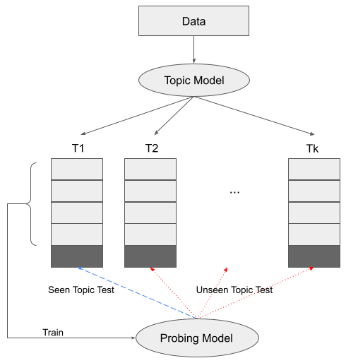

# BERTAnalysis
Analyse the topical component of BERT embedding based approach by using topic-aware probe



# The folder structure of the project is as follows:
+ `Embedding.py` - A class which generates different kinds of embeddings of input sentence
+ `TopicAwareProbe.py` - The class defines the topic-aware probe
+ `TopicModel.py` - A class for topic modelling 
+ `data` -  A folder which contains VNIC datasets (Cook et al 2008)[^1] and Porbing task dataset (Conneau et al. 2018)[^2]
	

# Entropy analysis of VNIC dataset

Run the following:
```
python TopicAwareProbe.py --entropyanalysis
```

# Topic-Aware Probe

Run the following to print seen scores, unseen scores and it's differences of task by using Random, GloVe and BERT final layer representations
```
python TopicAwareProbe.py --probe --task
```

Run the following to print seen scores, unseen scores and it's differences of task task by using including representations of all layers of BERT
```
python TopicAwareProbe.py --probe --task --alllayers
```

Set `task` as
+ `fullidiom` - for idiom token identification probing task
+ `bigram_shift` - for bigram shift probing task
+ `sentence_length` - for sentence length probing task
+ `coordination_inversion` - for coordination inversion probing task
+ `subj_number`- for subject number probing task
+ `obj_number`	-	for object number probing task
+ `top_constituents` - for topic constituents probing task
+ `odd_man_out`		- for semantic odd man out probing task
+ `tree_depth` - for tree depth probing task
+ `past_present` - for past present probing task

[^1]: Cook, P., Fazly, A., and Stevenson, S. 2008. The VNC-tokens dataset. In Proceedings of the LREC Workshop Towards a Shared Task for Multiword Expressions (MWE 2008), pp. 19–22.
[^2]: Conneau, A., Kruszewski, G., Lample, G., Barrault, L., and Baroni, M. 2018. What you can cram into a single $&!#* vector: Probing sentence embeddings for linguistic properties. In Proceedings of the 56th Annual Meeting of the Association for Computational Linguistics (Volume 1: Long Papers), pp. 2126–2136, Melbourne, Australia. Association for Computational Linguistics. 
